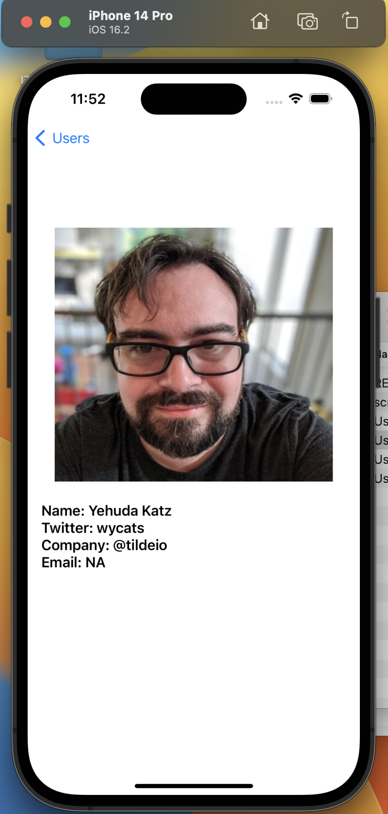

# UsersApp
 -  This is an app that lists and displays details of all the users using [Github Users API](https://api.github.com/users)

### How to Clone / Open the app

- Goto github link [Users APP](https://github.com/keshgurung/UsersApp)
- Open terminal, select a place to clone the project eg: cd desktop
- Use command ``` git clone https://github.com/keshgurung/UsersApp ``` to clone the project locally.
- Open the project, CLick on the UsersApp.xcodeproj file. The file will open in XCode.
- Goto product menu and select run or simply click on the play button to run the app in simulator.
- To run tests, goto product menu and click on test. All the tests will run on the simulator.

### XCode
- XCode Version: 14.2
- Minimum Deployment: iOS 16.0 and over

### Architecture and design pattern:
- The app follows Repository Clean Architecture, with dependency injection pattern, singleton design pattern (coredata). 
- All the unit test cases are written using XCTest framework (native iOS).
- Mock and stub technique is used writing the unit test cases in the app to test the network service.

### Offline View:
- The app can be viewed offline when there is no network/ wifi. The data is saved in the Core Data (iOS persistance framework) which will be used to show the items when there is no network coverage.

### Screenshots (with localised and base language)

- Main screen


- Details screen


